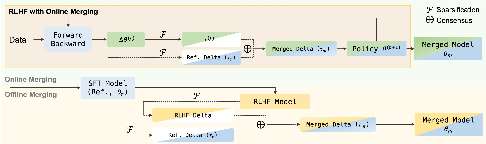

# Online Merging Optimizers

*Keming Lu, Bowen Yu, Fei Huang, Yang Fan, Runji Lin, Chang Zhou*

Qwen, Alibaba Inc.


This is the repository contains core implementations of the online merging optimizers, proposed by [Online Merging Optimizers for Boosting Rewards and
Mitigating Tax in Alignment]().

## Update

Thanks for the interest in online merging optimizers! We are working on a PR to merge our optimizers into LLaMa-Factory. Stay tune!


## Introduction

Effectively aligning Large Language Models (LLMs) with human-centric values while preventing the degradation of abilities acquired through Pre-training and Supervised Fine-tuning (SFT) poses a central challenge in Reinforcement Learning from Human Feedback (RLHF). In this paper, we first discover that interpolating RLHF and SFT model parameters can adjust the trade-off between human preference and basic capabilities, thereby reducing the alignment tax at the cost of alignment reward. Inspired by this, we propose integrating the RL policy and SFT models at each optimization step in RLHF to continuously regulate the training direction, introducing the Online Merging Optimizer. Specifically, we merge gradients with the parameter differences between SFT and pretrained models, effectively steering the gradient towards maximizing rewards in the direction of SFT optimization. We demonstrate that our optimizer works well with different LLM families, such as Qwen and LLaMA, across various model sizes ranging from 1.8B to 8B, various RLHF algorithms like DPO and KTO, and existing model merging methods. It significantly enhances alignment reward while mitigating alignment tax, achieving higher overall performance across 14 benchmarks. A more detailed manuscript in [paper](assets/online_merging_arxiv_review.pdf).




## Installation

You can install the source codes from this repository

```
git clone https://github.com/QwenLM/online_merging_optimizers
cd online_merging
pip install -e .
```

## Usage

### Applying online merging optimizers

There are two major differences in the initialization of online merging optimizers compared with original AdamW:

- **Building a mapping between parameters and names**: When collecting the parameter groups for the optimizer, a mapping between parameters and names need to be collected as well for mapping params with delta params in the online merging optimizers. The mapping is Tuple[(group_idx:int, param_idx:int)] -> name:str, group_idx is used to distinct different param groups such as params with or without weight decay, param_idx denotes the index of a specific param in the group.

- **Passing the base and reference models along with the arguments for online merging optimizers**: Before the optimization, online merging optimizers require an initialization of delta parameters by passing base and reference models to the `init_ref_param_diff` function.

```
def _create_online_merging_optimizer(
    model: "PreTrainedModel",
    training_args: "Seq2SeqTrainingArguments",
    finetuning_args: "FinetuningArguments",
    base_model, # base model (pt model that reference model trained from)
    ref_model, # reference model (initial policy)
    om_mode='ondare', # ondare or onties
) -> "torch.optim.Optimizer":
    from online_merging import OnDAREAdamW, OnTIESAdamW
    if om_mode == 'ondare':
        optimizer_cls = ODAdamW
    elif om_mode == 'onties':
        optimizer_cls = OTAdamW
    else:
        raise ValueError(f"{finetuning_args.om_mode} is not supported yet.")
    
    param_name_map = {}
    param_w_decay = {"params": [], "weight_decay": training_args.weight_decay}
    param_wo_decay = {"params": [], "weight_decay": 0.0}
    for n, p in model.named_parameters():
        if p.requires_grad:
            param_w_decay["params"].append(p)
            # build a param_name_map when caching the param group for the optimizer
            param_name_map[(0, len(param_w_decay["params"]) - 1)] = n
    
    optimizer_grouped_parameters = [param_w_decay, param_wo_decay]

    optimizer_kwargs = {
                "lr": training_args.learning_rate,
                "betas": (training_args.adam_beta1, training_args.adam_beta2),
                "eps": training_args.adam_epsilon,
            }

    # passing the parameters for online merging optimizers
    optimizer_kwargs.update({
        "param_name_map": param_name_map,
        "reserve_p": finetuning_args.reserve_p,
        "alpha": finetuning_args.alpha,
        "use_merge": finetuning_args.use_merge,
        "rescale": finetuning_args.rescale,
        "online_step": finetuning_args.online_step,
    })
    optimizer = optimizer_cls(optimizer_grouped_parameters, **optimizer_kwargs)
    optimizer.init_ref_param_diff(ref_model, base_model)
    del base_model
    return optimizer
```


### Experiments in our manuscript

Our experiments are run with LLaMa-Factory(llmtuner)==0.7.0. You can simply install the LLaMa-Factory in this repository by `cd LLaMa-Factory && pip install -e .`.

The script for running DPO/IPO/KTO with online merging optimizers (`LLaMa-Factory/run_dpo_om.sh`) in LLaMa-Factory as followed:

```
export CUDA_VISIBLE_DEVICES=0,1,2,3,4,5,6,7
export WANDB_DISABLED=true

MODEL_SIZE=7B
BETA=0.1
LR=1e-6
OPTIMIZER=ondare
USE_EMA=True
USE_RESCALE=False
RESERVE_P=0.01
ALPHA=1e-7
DATASET=ultrafeedback_binarized
POSTFIX=

MODEL_PATH="reference model path" # set your reference model
BASE_MODEL_PATH="base model path" # set your base model

OUTPUT_DIR=saves/Qwen-${MODEL_SIZE}/dpo/${DATASET}_${OPTIMIZER}_${DROP_RATE}_ema_${USE_EMA}_rescale_${USE_RESCALE}_shrink_${SHRINK_BASE}_alpha_${ALPHA}_beta_${BETA}_lr_${LR}$POSTFIX

accelerate launch \
    --config_file examples/accelerate/fsdp_config.yaml \
    src/train_bash.py \
    --stage dpo \
    --do_train \
    --model_name_or_path $MODEL_PATH \
    --dataset $DATASET \
    --dataset_dir data \
    --template qwen \
    --dpo_beta $BETA \
    --dpo_loss sigmoid \
    --ref_model $MODEL_PATH \
    --finetuning_type full \
    --output_dir $OUTPUT_DIR \
    --overwrite_cache \
    --overwrite_output_dir \
    --cutoff_len 2048 \
    --preprocessing_num_workers 16 \
    --per_device_train_batch_size 1 \
    --per_device_eval_batch_size 1 \
    --gradient_accumulation_steps 1 \
    --lr_scheduler_type cosine \
    --logging_steps 10 \
    --warmup_steps 100 \
    --save_steps 100 \
    --eval_steps 100 \
    --evaluation_strategy no \
    --learning_rate $LR \
    --num_train_epochs 2.0 \
    --ddp_timeout 180000000 \
    --plot_loss \
    --report_to tensorboard \
    --bf16 \
    --use_online_merging \
    --om_mode $OPTIMIZER \
    --reserve_p ${RESERVE_P} \
    --alpha $ALPHA \
    --use_merge ${USE_EMA} \
    --base_model ${BASE_MODEL_PATH} \
    --rescale ${USE_RESCALE} 
```

Online merging optimizers are not adapted to deepspeed yet, so we run it with FSDP, which can also support DPO training of large-scale LLMs, such as *Qwen1.5-72B-Chat* or *LLaMa-3-70B-Instruct*. Please set `fsdp_use_orig_params: true` so that online merging optimizers can create mapping between parameters and names. An FSDP configuration for reference is shown below:

```
compute_environment: LOCAL_MACHINE
debug: true
distributed_type: FSDP
downcast_bf16: 'no'
fsdp_config:
  fsdp_auto_wrap_policy: TRANSFORMER_BASED_WRAP
  fsdp_backward_prefetch: BACKWARD_PRE
  fsdp_cpu_ram_efficient_loading: true
  fsdp_forward_prefetch: false
  fsdp_offload_params: false
  fsdp_sharding_strategy: FULL_SHARD
  fsdp_state_dict_type: FULL_STATE_DICT
  fsdp_sync_module_states: true
  fsdp_use_orig_params: true
machine_rank: 0
main_training_function: main
mixed_precision: bf16
num_machines: 1 # the number of nodes
num_processes: 8 # the number of GPUs in all nodes
rdzv_backend: static
same_network: true
tpu_env: []
tpu_use_cluster: false
tpu_use_sudo: false
use_cpu: false
```


## Citation

```
@misc{lu2024online,
      title={Online Merging Optimizers for Boosting Rewards and Mitigating Tax in Alignment}, 
      author={Keming Lu and Bowen Yu and Fei Huang and Yang Fan and Runji Lin and Chang Zhou},
      year={2024},
      eprint={2405.17931},
      archivePrefix={arXiv},
}
```
